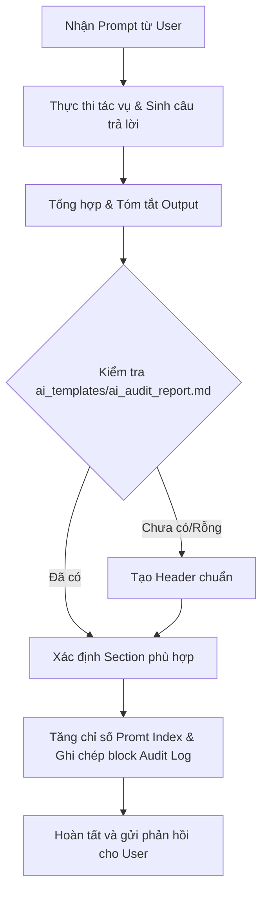

# Automation AI Audit Logs Skill

Skill này quy định quy trình và tiêu chuẩn để Agent **luôn luôn tự động ghi nhận nhật ký tương tác (AI Audit Log)** vào file `ai_templates/ai_audit_report.md` sau mỗi lượt phản hồi cho người dùng, đảm bảo tính minh bạch, tính học thuật và tuân thủ 100% tiêu chí Anti-AI-Cheat của bài tập.

---

## 1. MỤC TIÊU & NGUYÊN TẮC CỐT LÕI

1. **Tự động hóa hoàn toàn (Always-On Automation):** Sau khi xử lý xong câu lệnh của người dùng, Agent phải tự động cập nhật nhật ký mà không cần người dùng nhắc nhở.
2. **Trung thực & Nguyên bản (Prompt Integrity):** Lưu trữ chính xác, đầy đủ nội dung câu prompt của người dùng (kể cả các đường dẫn file, tham số đi kèm).
3. **Rút gọn & Đánh giá có cấu trúc (Concise AI Output Summary):** Phần phản hồi của AI (`Output`) phải được cô đọng thành các ý chính (bullet points), tóm tắt các quyết định kỹ thuật, mã nguồn đã sinh ra, phân tích hoặc giải pháp được đề xuất, không sao chép lại toàn bộ văn bản thô quá dài.
4. **Chuẩn hóa cấu trúc (HW04 Compliance):** Tuân thủ cấu trúc phân cấp Header, Section, Promt Index, Metadata theo mẫu chuẩn đã sử dụng ở HW04.

---

## 2. FILE ĐÍCH & QUY TẮC ĐỊNH VỊ

- **Đường dẫn file đích:** `ai_templates/ai_audit_report.md`
- **Khởi tạo ban đầu:** Nếu file `ai_templates/ai_audit_report.md` chưa tồn tại hoặc đang rỗng, Agent phải tự động khởi tạo phần tiêu đề chuẩn:

```markdown
# AI Audit Report & AI Critique - Individual Deliverable

---

## I. AI AUDIT LOG (NHẬT KÝ SỬ DỤNG AI)

Mỗi phiên tương tác với AI hỗ trợ thực hiện bài tập lớn được ghi lại đầy đủ dưới đây theo thứ tự thời gian.
```

---

## 3. CẤU TRÚC PHÂN MỤC (SECTIONS) TRONG HW05

Agent sẽ tự động nhóm các câu prompt vào các Section tương ứng với từng giai đoạn thực hiện HW05:

1. `## Thiết lập môi trường và Xây dựng Agent Skill`
2. `## Task 1: Thiết kế Kịch bản Test Plan & Dữ liệu Data-Driven (Load/Stress/Spike)`
3. `## Task 1: Thực thi kiểm thử & Giám sát tài nguyên hệ thống (Resource Monitoring)`
4. `## Task 2: Phân tích kết quả JTL & Săn lỗi AI (Misinterpretation Hunt)`
5. `## Task 3: Đề xuất Continuous Performance Testing & CI/CD Pipeline`
6. `## Tổng hợp Báo cáo, AI Critique & Đóng gói sản phẩm`

*(Nếu có câu hỏi thuộc chủ đề đặc biệt khác, Agent có thể tạo tiêu đề Section cấp 2 `## <Tên Chủ Đề>` phù hợp).*

---

## 4. SCHEMA ĐỊNH DẠNG CỦA MỖI PROMPT

Mỗi lượt tương tác được định dạng chính xác theo cú pháp sau:

```markdown
### Promt <Index>:

- **Công cụ AI sử dụng:** <Tên Model> (<Môi trường/IDE>)
- **Ngày giờ tương tác:** <HH:mm DD/MM/YYYY>
- **Câu lệnh đã hỏi (Prompt):**

  ```text
  <Toàn bộ nội dung prompt của người dùng>
  ```

- **Kết quả phản hồi của AI (Output):**
  ```text
  <Nội dung tóm tắt súc tích, cấu trúc rõ ràng gồm các ý chính/kết quả/giải pháp của AI>
  ```
```

### Chi tiết các trường dữ liệu:
- **`### Promt <Index>:`**: Số thứ tự tăng dần theo từng Section (ví dụ: `### Promt 1:`, `### Promt 2:`, ...).
- **`Công cụ AI sử dụng:`**: Tên mô hình đang thực thi kèm môi trường (Ví dụ: `Gemini 3.7 Flash (High) (Antigravity IDE)`).
- **`Ngày giờ tương tác:`**: Thời gian thực tế lúc thực hiện theo định dạng `HH:mm DD/MM/YYYY` (Ví dụ: `09:30 28/08/2026`).
- **`Câu lệnh đã hỏi (Prompt):`**: Nội dung người dùng nhập vào.
- **`Kết quả phản hồi của AI (Output):`**: Đoạn tóm tắt chất lượng cao từ phản hồi của AI, bao gồm:
  - Mục tiêu/Yêu cầu đã hoàn thành.
  - Các file mã nguồn/tài liệu được tạo mới hoặc chỉnh sửa.
  - Các thông số kỹ thuật hoặc điểm mấu chốt được thiết lập.
  - Đánh giá ngắn gọn về kết quả.

---

## 5. QUY TRÌNH THỰC THI TỰ ĐỘNG CỦA AGENT (EXECUTION PROTOCOL)

Khi nhận được bất kỳ prompt nào từ người dùng, Agent thực hiện theo quy trình 4 bước:



### Chi tiết từng bước:
1. **Bước 1 (Xử lý yêu cầu chính):** Agent nghiên cứu, viết code, tạo file hoặc giải đáp câu hỏi của người dùng như bình thường.
2. **Bước 2 (Tổng hợp & Đánh giá Output):** Trước khi kết thúc lượt tương tác, Agent tự trích xuất và cô đọng câu trả lời của chính mình thành dạng tóm tắt kỹ thuật (5 - 15 dòng).
3. **Bước 3 (Cập nhật file Audit Log):**
   - Đọc file `ai_templates/ai_audit_report.md`.
   - Tìm Section hiện tại hoặc tạo Section mới.
   - Thêm khối `### Promt X:` với đầy đủ metadata: Công cụ AI, Thời gian, Prompt thô và Output rút gọn.
   - Ghi lại vào file `ai_templates/ai_audit_report.md`.
4. **Bước 4 (Phản hồi cho User):** Trả lời người dùng kèm thông báo đã tự động ghi nhận Audit Log cho phiên này.

---

## 6. MẪU THAM KHẢO CHUẨN (HW04 REFERENCE EXAMPLE)

```markdown
## Phân tích yêu cầu và cấu trúc thư mục

### Promt 1:

- **Công cụ AI sử dụng:** Gemini 3.7 Flash (High) (Antigravity IDE)
- **Ngày giờ tương tác:** 08:36 12/08/2026
- **Câu lệnh đã hỏi (Prompt):**

  ```text
  [2026.HW04.Automation%20Testing_En.pdf](file:///d:/STD/Y3/Y3S3/KiemThuPM/hw/hw4/2026.HW04.Automation%20Testing_En.pdf) từ file này bạn có thể viết cho tôi 1 file guiding.md chi tiết tất cả những gì tôi cần thực hiện, các bước thi hiện, chi tiết từng bước ra sao, cần làm gì kèm với checklist những gì cần hoàn thành và nộp được không
  ```

- **Kết quả phản hồi của AI (Output):**
  ```text
  Tóm tắt nội dung chính trong file guiding.md:
  1. Tổng quan & Nguyên tắc cốt lõi:
     - Mã bài tập HW04-AI (Kiểm thử tự động Web EShop).
     - Chiến lược AI-First: Prompt AI từng bước, không dùng prompt chung chung.
     - Human Review: Bắt buộc rà soát, sửa lỗi và giải trình phần AI làm sai/thiếu.
     - Anti-AI-Cheat: Watermark tên sinh viên trong HTML report + Video demo giọng thật.
  2. Lộ trình 9 bước thực hiện chi tiết:
     - Bước 1: Setup kho mã nguồn GitHub Public & Playwright.
     - Bước 2: Thiết kế tối thiểu 12 test cases / tính năng và Data-driven testing.
     - Bước 3: Sinh kịch bản và áp dụng ít nhất 3 kiểu Assertions.
     - Bước 4: Rà soát, sửa lỗi code AI & duy trì tối thiểu 8 commits.
     - Bước 5: Chạy trên 3 trình duyệt (Chromium, Firefox, WebKit) xuất HTML report.
     - Bước 6: Báo cáo Bug Report lên GitHub Issues.
     - Bước 7: Quay Video demo YouTube Unlisted >= 5 phút.
     - Bước 8: Xây dựng Agent Skill & Video demo.
     - Bước 9: Viết AI Critique (200-300 từ) và bảng AI Audit Report.
  ```
```
