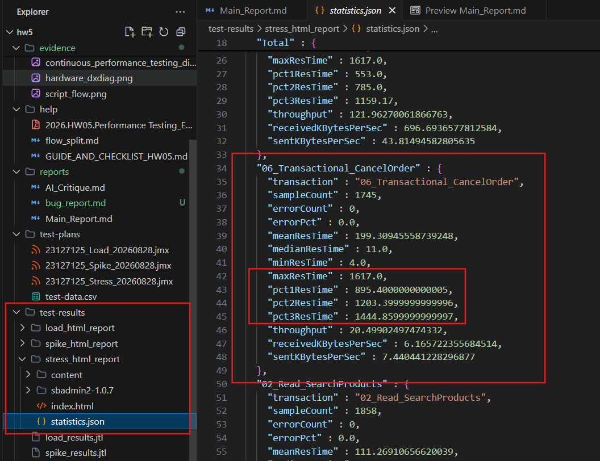

# [BUG-01] Severe Performance Degradation on Cancel Order API under High Stress Load

## 1. Description
When executing the Stress Testing scenario with 150 concurrent Virtual Users over 90 seconds, the response time for the Cancel Order endpoint (`PUT /api/orders/:id/cancel`) degraded severely. 

## 2. Metrics & Evidence
- **Test Scenario:** `23127125_Stress_20260828.jmx`
- **Data Source:** `test-results/stress_results.jtl`
- **Median Latency (p50):** `11.00 ms`
- **Average Latency:** `199.31 ms`
- **95th Percentile (p95):** `1200.60 ms` (Violates 500ms SLA by 2.4x)
- **Maximum Latency:** `1617.00 ms` (1.61 seconds)

## 3. Impact
Under high traffic (e.g. flash sales or promotional campaigns), users attempting to cancel or modify orders will experience massive delays exceeding 1.6 seconds, potentially causing frontend timeout errors.

## 4. Steps to Reproduce
1. Start EShop backend at `http://localhost:3000`.
2. Run JMeter Stress Test:
   ```bash
   jmeter -n -t test-plans/23127125_Stress_20260828.jmx -l test-results/stress_results.jtl
   ```
3. Inspect `06_Transactional_CancelOrder` latency metrics in `stress_results.jtl`.

## 5. Bug Evidence Screenshot


