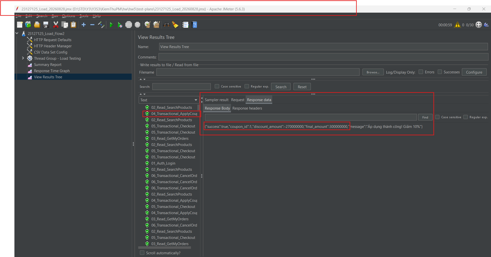

# [BUG-02] Incorrect Discount Calculation and Inflated Final Amount in Apply Coupon API

## 1. Description
When calling the Apply Coupon API (`POST /api/apply-coupon`) with a valid percentage-based discount coupon (`SAVE10` - 10% discount) for an order of `30,000,000` VND, the API returns a negative discount amount and inflates the final order total by 10x instead of reducing it.

## 2. Steps to Reproduce
1. Send a POST request to `http://localhost:3000/api/apply-coupon` with body:
   ```json
   {
     "code": "SAVE10",
     "total_amount": 30000000,
     "user_id": 1
   }
   ```
2. Observe the JSON response.

## 3. Actual Result
```json
{
  "success": true,
  "coupon_id": 1,
  "discount_amount": -270000000,
  "final_amount": 300000000,
  "message": "Áp dụng thành công! Giảm 10%"
}
```
- `discount_amount` is `-270,000,000` VND.
- `final_amount` is `300,000,000` VND (10 times the original price).

## 4. Expected Result
- `discount_amount` should be `3,000,000` VND (10% of 30,000,000).
- `final_amount` should be `27,000,000` VND.

## 5. Bug Evidence Screenshot

