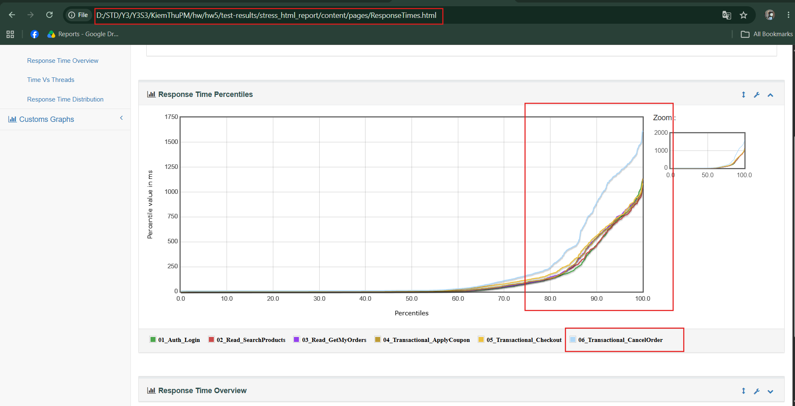

# [BUG-03] Heavy Tail Latency and Queue Contention Across System under Sustained Stress

## 1. Description
During the 150-VU Stress Test over 90 seconds, the overall system exhibits extreme tail-latency skewness. While 50% of requests (p50) complete in only `7.00 ms`, the 90th, 95th, and 99th percentiles escalate rapidly due to sustained resource queueing.

## 2. Metrics Breakdown (from `test-results/stress_results.jtl`)
- **Median (p50):** `7.00 ms`
- **Average:** `131.26 ms`
- **90th Percentile (p90):** `553.00 ms`
- **95th Percentile (p95):** `784.95 ms`
- **99th Percentile (p99):** `1157.38 ms` (Exceeds 1.15 seconds)
- **Maximum Latency:** `1617.00 ms`

## 3. Impact
Sustained traffic creates severe response queueing that disproportionately degrades the experience of 5% to 10% of users, leading to perceived system freezing.

## 4. Bug Evidence Screenshot

