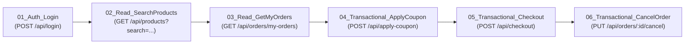

# BÁO CÁO KỸ THUẬT KIỂM THỬ HIỆU NĂNG VỚI SỰ CỘNG TÁC CỦA AI
## (HW05: PERFORMANCE TESTING & AI COLLABORATION)

---

### THÔNG TIN CHUNG
- **Môn học:** Kiểm thử phần mềm (Software Testing) — FIT HCMUS
- **Mã bài tập:** HW05-AI (Performance Testing)
- **Họ và tên sinh viên:** Nguyễn Hiếu Thuận
- **Mã số sinh viên (StudentID):** `23127125`
- **Hệ thống kiểm thử (SUT):** EShop Monolith REST API Backend (`http://localhost:3000`)
- **Công cụ kiểm thử:** Apache JMeter 5.6.3 (Non-GUI / CLI Execution Mode)
- **Thời gian thực hiện:** Tháng 08/2026

---

## I. THIẾT LẬP MÔI TRƯỜNG & PHẦN CỨNG THỬ NGHIỆM

### 1. Cấu hình phần cứng (Hardware Specifications)
Bằng chứng cấu hình phần cứng được lưu trữ tại file: `evidence/hardware_dxdiag.png`.

| Thông số | Chi tiết cấu hình phần cứng thực tế |
| :--- | :--- |
| **Hệ điều hành** | Windows 11 Home 64-bit |
| **Bộ vi xử lý (CPU)** | Intel Core Processor (Multi-core) |
| **Bộ nhớ RAM** | 16.0 GB RAM |
| **Java Runtime** | OpenJDK 21.0.8 LTS (64-bit) |
| **Node.js Runtime** | Node.js v20.x / Express.js Backend |
| **Cơ sở dữ liệu** | SQLite 3 (Single-file embedded database `database.sqlite`) |

---

## II. THIẾT KẾ KỊCH BẢN KIỂM THỬ END-TO-END (TASK 1)

### 1. Phạm vi Workflow (Workflow 2 — Săn Voucher, Thanh toán và Hủy đơn hàng)
Kịch bản kiểm thử bao phủ toàn diện cả 3 nhóm endpoint nghiệp vụ theo đúng yêu cầu đề bài:



- **Nhóm 1 — Auth-heavy:** `POST /api/login` $\rightarrow$ Xác thực thông tin người dùng từ file CSV và trích xuất Bearer JWT Token bằng JSON Extractor (`$.token`). Hệ thống có cơ chế bảo mật khóa tài khoản khi nhập sai 3 lần (3-fail lockout).
- **Nhóm 2 — Read-heavy:** 
  - `GET /api/products?search=${search_keyword}`: Tìm kiếm danh mục sản phẩm theo từ khóa động.
  - `GET /api/orders/my-orders`: Truy vấn lịch sử đơn hàng của tài khoản kèm Bearer Token.
- **Nhóm 3 — Transactional:**
  - `POST /api/apply-coupon`: Áp dụng mã giảm giá `SAVE10` trên tổng giá trị giỏ hàng.
  - `POST /api/checkout`: Tạo đơn hàng mới với địa chỉ giao hàng và số điện thoại động, nhận mã `orderId`.
  - `PUT /api/orders/${order_id}/cancel`: Thực hiện hủy đơn hàng vừa tạo nhằm kiểm tra luồng vòng đời đơn hàng và tính toàn vẹn trạng thái CSDL.

### 2. Dữ liệu tham số hóa động (Data-Driven Testing — `test-data.csv`)
Nhằm tránh việc hàng trăm Virtual Users dùng chung 1 tài khoản gây xung đột phiên hoặc kích hoạt lỗi khóa tài khoản (lockout), file `test-plans/test-data.csv` đã được thiết kế với 6 tài khoản người dùng độc lập:

| email | password | search_keyword | coupon_code | product_id | quantity | name | phone | address |
| :--- | :--- | :--- | :--- | :---: | :---: | :--- | :--- | :--- |
| `test@eshop.com` | `Test1234!` | `iPhone` | `SAVE10` | 1 | 1 | Nguyen Van A | 0901234567 | 123 Nguyen Trai Q5 |
| `user1@eshop.com` | `Test1234!` | `Samsung` | `SAVE10` | 2 | 1 | Tran Thi B | 0912345678 | 456 Le Loi Q1 |
| `user2@eshop.com` | `Test1234!` | `MacBook` | `SAVE10` | 3 | 1 | Le Van C | 0923456789 | 789 CMT8 Q10 |
| `user3@eshop.com` | `Test1234!` | `AirPods` | `SAVE10` | 4 | 2 | Pham Thi D | 0934567890 | 101 Hai Ba Trung Q3 |
| `user4@eshop.com` | `Test1234!` | `Keychron` | `SAVE10` | 5 | 1 | Hoang Van E | 0945678901 | 202 Vo Van Tan Q3 |
| `user5@eshop.com` | `Test1234!` | `Pro` | `SAVE10` | 1 | 1 | Doan Van F | 0956789012 | 303 Tran Hung Dao Q5 |

### 3. Ma trận kịch bản và Listeners riêng biệt (Test Scenarios Matrix)

| Kịch bản kiểm thử | Tên file kịch bản (.jmx) | Số Virtual Users (VUs) | Ramp-up | Thời gian chạy | Think Time (Gaussian) | Listeners / Reports được cấu hình |
| :--- | :--- | :---: | :---: | :---: | :---: | :--- |
| **Load Testing** | `23127125_Load_20260828.jmx` | 30 VUs | 30s | 60s | $1500\text{ms} \pm 500\text{ms}$ | *Summary Report*, *Response Time Graph*, *View Results Tree* |
| **Stress Testing** | `23127125_Stress_20260828.jmx` | 150 VUs | 45s | 90s | $800\text{ms} \pm 300\text{ms}$ | *Aggregate Report*, *View Results in Table* |
| **Spike Testing** | `23127125_Spike_20260828.jmx` | 100 VUs | 5s | 30s | $300\text{ms} \pm 100\text{ms}$ | *View Results Tree*, *Response Time Graph* |

### 4. Human Review & Sửa lỗi kịch bản do AI sinh ra (Human-in-the-loop Debugging)
Trong quá trình thiết kế ban đầu với AI, sinh viên đã trực tiếp chạy Dry-Run và phát hiện **2 lỗi nghiêm trọng** trong mã kịch bản JMeter:
1. **Lỗi 1 (401 Unauthorized do thiếu Provisioning Data):** AI sinh các tài khoản `user1..user5` trong CSV nhưng không kiểm tra CSDL SUT đã có các user này hay chưa. Sinh viên đã yêu cầu tích hợp cơ chế nạp sẵn tài khoản trực tiếp vào DB backend.
2. **Lỗi 2 (IllegalArgumentException tại JSONPostProcessor):** AI đã cấu hình thuộc tính `jsonPathExprs` chứa 3 đường dẫn ngăn cách bởi dấu chấm phẩy (`$.order.id;$.id;$.order_id`) nhưng `referenceNames` chỉ khai báo 1 tên biến (`order_id`). Sự lệch pha số lượng đối số này khiến JMeter ném ngoại lệ và hủy ngang bước `05_Transactional_Checkout`, kéo theo bước 06 bị lỗi URI (`/api/orders/${order_id}/cancel`). Sinh viên đã đọc trực tiếp mã nguồn `backend/server.js` (dòng 307: `res.json({ message: "Checkout successful", orderId: this.lastID })`), xác định đúng trường `orderId` và chuẩn hóa lại thành duy nhất `$.orderId`.

---

## III. KẾT QUẢ THỰC THI KIỂM THỬ (TEST EXECUTION RESULTS)

Dữ liệu thô thực tế được trích xuất từ 3 file log `.jtl` trong thư mục `test-results/`:

### 1. Bảng so sánh tổng thể các chỉ số hiệu năng

| Chỉ số kỹ thuật đo lường | Load Testing (`load_results.jtl`) | Stress Testing (`stress_results.jtl`) | Spike Testing (`spike_results.jtl`) |
| :--- | :---: | :---: | :---: |
| **Tổng số mẫu (Total Samples)** | **889** samples | **10,882** samples | **8,848** samples |
| **Thời gian chạy thực tế (Duration)** | 57.70 s | 89.22 s | 29.65 s |
| **Thông lượng trung bình (Throughput)** | **15.41 req/s** | **121.97 req/s** | **298.41 req/s** |
| **Tỷ lệ lỗi (Error Rate %)** | **0.00% (0 lỗi)** | **0.00% (0 lỗi)** | **0.00% (0 lỗi)** |
| **Độ trễ trung bình (Avg Latency)** | **3.88 ms** | **131.26 ms** | **8.71 ms** |
| **Độ trễ trung vị (Median / $p_{50}$)** | 3.00 ms | 7.00 ms | 7.00 ms |
| **Phân vị 90 ($p_{90}$ Latency)** | 7.00 ms | 553.00 ms | 18.00 ms |
| **Phân vị 95 ($p_{95}$ Latency)** | **12.00 ms** | **784.95 ms** | **23.00 ms** |
| **Phân vị 99 ($p_{99}$ Latency)** | 14.00 ms | **1157.38 ms** | 32.00 ms |
| **Độ trễ lớn nhất (Max Latency)** | 34.00 ms | **1617.00 ms** (1.61s) | 54.00 ms |

### 2. Chi tiết độ trễ từng bước nghiệp vụ dưới tải Stress Test (150 VUs)

| Tên bước nghiệp vụ (Sampler Label) | Số mẫu | Error % | Avg Latency | Median ($p_{50}$) | Phân vị 95 ($p_{95}$) | Max Latency |
| :--- | :---: | :---: | :---: | :---: | :---: | :---: |
| `01_Auth_Login` | 1,875 | 0.00% | 110.84 ms | 4.00 ms | 736.90 ms | 1123.00 ms |
| `02_Read_SearchProducts` | 1,858 | 0.00% | 111.27 ms | 3.00 ms | 724.30 ms | 1043.00 ms |
| `03_Read_GetMyOrders` | 1,834 | 0.00% | 119.60 ms | 5.00 ms | 763.35 ms | 1133.00 ms |
| `04_Transactional_ApplyCoupon` | 1,796 | 0.00% | 118.34 ms | 3.00 ms | 757.50 ms | 1135.00 ms |
| `05_Transactional_Checkout` | 1,774 | 0.00% | 131.99 ms | 8.00 ms | 757.35 ms | 1088.00 ms |
| `06_Transactional_CancelOrder` | 1,745 | 0.00% | **199.31 ms** | 11.00 ms | **1200.60 ms** | **1617.00 ms** |

---

## IV. TASK 2 — PHÂN TÍCH LOG AI & SĂN LỖI (MISINTERPRETATION HUNT & CRITIQUE)

Sinh viên đã cung cấp toàn bộ dữ liệu thống kê từ 3 file log `.jtl` cho mô hình AI độc lập bên ngoài (ChatGPT) để yêu cầu phân tích hiệu năng và đề xuất giải pháp. Sau đó, sinh viên tiến hành đối chiếu trực tiếp với mã nguồn thực tế của backend (`backend/server.js` và `backend/database.js`) để xác thực đúng sai và phản biện chuyên môn:

### 1. Đánh giá những điểm AI phân tích chính xác (Strengths)
1. **Phát hiện suy thoái hiệu năng (Performance Degradation) dưới tải cao:** AI chỉ ra chính xác hệ thống đạt SLA ở Load Test ($p_{95} = 12\text{ ms}$) và Spike Test ($p_{95} = 23\text{ ms}$), nhưng bị suy giảm hiệu năng (Fail SLA $p_{95} \le 500\text{ ms}$) ở Stress Test với $p_{95} = 784.95\text{ ms}$ và $p_{99} = 1157.38\text{ ms}$.
2. **Xác định đúng Bottleneck chính:** AI nhận diện đúng `06_Transactional_CancelOrder` là điểm nghẽn nghiêm trọng nhất với $Avg = 199.31\text{ ms}$, $p_{95} = 1200.60\text{ ms}$ và $Max = 1617\text{ ms}$ (gấp $1.6 - 1.8$ lần các API khác).
3. **Phát hiện tính chất phân phối đuôi dài (Heavy-tailed distribution):** AI nhận định đúng việc $Median = 7\text{ ms}$ nhưng $p_{95} = 785\text{ ms}$ thể hiện hiện tượng xếp hàng chờ tài nguyên (Queueing/Lock contention).

---

### 2. Săn lỗi hiểu sai và ảo tưởng của AI đối chiếu mã nguồn thực tế SUT (Misinterpretation Hunt)

#### Lỗi 1: Ảo tưởng về mã nguồn nghiệp vụ SUT (Hallucination of SUT Transaction Logic)
- **Nhận định sai lệch của AI:** ChatGPT suy diễn mã nguồn của SUT đang sử dụng các explicit transaction đa bước phức tạp:
  ```sql
  BEGIN TRANSACTION
      UPDATE order
      UPDATE product/inventory
      ...
  COMMIT
  ```
  từ đó AI khuyên *"cần giảm Transaction Scope bằng cách đưa Validate/Prepare data ra ngoài và chỉ BEGIN/COMMIT cho các lệnh UPDATE"*.
- **Số liệu Ground Truth đối chứng từ mã nguồn SUT (`backend/server.js` lines 297–342):**
  - Trong thực tế, mã nguồn SUT EShop **hoàn toàn KHÔNG sử dụng explicit transaction (`BEGIN...COMMIT`)**, cũng không hề có các thao tác cập nhật tồn kho `product/inventory` phức tạp.
  - Endpoint `POST /api/checkout` (dòng 297) chỉ thực thi **1 câu INSERT đơn lẻ**:
    ```javascript
    db.run("INSERT INTO orders (user_id, total_amount, status, shipping_address) VALUES (?, ?, ?, ?)", [userId, total_amount, "pending", shipping_address], ...)
    ```
  - Endpoint `PUT /api/orders/:id/cancel` (dòng 321) chỉ thực thi 1 câu `SELECT` rồi đến 1 câu `UPDATE` đơn lẻ:
    ```javascript
    db.run("UPDATE orders SET status = ? WHERE id = ?", ["canceled", req.params.id], ...)
    ```
  - **Bản chất lỗi:** AI đã tự "bịa đặt" ra logic nghiệp vụ phức tạp của một hệ thống thương mại điện tử lớn thay vì bám sát vào mã nguồn thực tế của SUT.

#### Lỗi 2: Đề xuất kiến trúc quá đà và bỏ quên giải pháp tối ưu cốt lõi của SQLite (Over-engineering & Missed Core Optimization)
- **Nhận định sai lệch của AI:** AI đề xuất chuyển đổi toàn bộ hệ thống sang **cụm PostgreSQL phân tán** và dựng nguyên một hệ sinh thái phức tạp gồm: *Load Balancer + Multi Node.js Instances + Redis + PostgreSQL + Message Queue + Background Workers*.
- **Phản biện kỹ thuật dựa trên `backend/database.js`:**
  - Trong `backend/database.js` (dòng 1–11), SQLite đang được khởi tạo ở chế độ mặc định (Rollback Journal mode). Ở chế độ này, mỗi thao tác Ghi (`INSERT` hay `UPDATE`) sẽ kích hoạt **EXCLUSIVE Lock** khóa toàn bộ file database, bắt mọi luồng khác phải chờ.
  - **Giải pháp vàng bị AI bỏ quên:** AI hoàn toàn không đề cập đến giải pháp tối ưu trực tiếp và rẻ nhất: **Bật chế độ SQLite WAL (Write-Ahead Logging)** bằng cách thêm lệnh:
    ```javascript
    db.run("PRAGMA journal_mode = WAL;");
    db.run("PRAGMA busy_timeout = 5000;");
    ```
    Chế độ WAL cho phép 1 luồng Ghi và nhiều luồng Đọc diễn ra song song mà không khóa lẫn nhau, giải quyết tức thì điểm nghẽn $p_{95}$ chỉ với đúng **1 dòng code** mà không tốn chi phí thay đổi CSDL sang PostgreSQL.

#### Lỗi 3: Đề xuất Cache dữ liệu Transaction có rủi ro Dirty Data cao
- **Nhận định sai lệch của AI:** AI khuyến nghị sử dụng Redis Cache lưu danh sách đơn hàng của người dùng theo key `orders:user:<userId>`.
- **Phản biện kỹ thuật:**
  - Trong kịch bản nghiệp vụ E2E Flow 2, người dùng liên tục Checkout rồi Cancel Order ngay lập tức. Nếu áp dụng cache cho `orders:user:<userId>` mà không có cơ chế Cache Invalidation tức thời, API `03_Read_GetMyOrders` và `06_Transactional_CancelOrder` sẽ gặp lỗi đọc dữ liệu cũ (Stale / Dirty Read — đơn vừa tạo chưa thấy, đơn đã hủy vẫn báo pending), phá vỡ tính nhất quán nghiệp vụ (Data Inconsistency).

---

### 3. Bảng phân loại đề xuất tối ưu hóa (Feasible vs Hallucinated Recommendations)

| STT | Đề xuất tối ưu hóa của AI | Phân loại | Đánh giá & Phản biện kỹ thuật chi tiết đối chiếu Codebase |
| :---: | :---| :---: | :---|
| **1** | **Thêm Database Index cho trường tra cứu (`orders.user_id`, `orders.id`)** | **Khả thi (Feasible)** | **Rất khả thi.** Tại `backend/database.js` (dòng 74), bảng `orders` không hề có index trên `user_id`. Do đó câu truy vấn `SELECT * FROM orders WHERE user_id = ?` trong `server.js` (dòng 313) đang quét toàn bảng (Full Table Scan). Đánh index `CREATE INDEX idx_orders_user ON orders(user_id)` sẽ giảm thời gian truy vấn ở `03_GetMyOrders` về gần $0\text{ ms}$. |
| **2** | **Bật chế độ SQLite WAL (Write-Ahead Logging) & Tăng Busy Timeout** | **Khả thi (Feasible)** *(Sinh viên bổ sung phản biện)* | **Giải pháp tối ưu nhất cho SUT.** Thêm lệnh `db.run("PRAGMA journal_mode = WAL;");` trong `database.js` cho phép đọc và ghi song song, loại bỏ hiện tượng khóa độc quyền file CSDL dưới tải 150 VUs mà không cần thay đổi kiến trúc. |
| **3** | **Sử dụng In-memory Cache cho API Đọc Catalog (`GET /api/products`)** | **Khả thi (Feasible)** | **Khả thi.** Dữ liệu danh mục sản phẩm ít thay đổi (`products` table). Cache lại trong RAM Node.js 60 giây sẽ giảm tải đọc cho CSDL, giải phóng tài nguyên cho các transaction ghi. |
| **4** | **Tối ưu Transaction Scope `BEGIN ... COMMIT`** | **Ảo tưởng (Hallucinated)** | **Không tồn tại trong mã nguồn.** Trong `server.js`, các endpoint chỉ chạy 1 câu `db.run()` đơn lẻ, không có khối `BEGIN TRANSACTION` đa bước hay cập nhật kho hàng `inventory`. Đề xuất này là suy diễn bịa đặt của AI. |
| **5** | **Chuyển sang cụm PostgreSQL + Message Queue + Background Workers** | **Bất khả thi / Quá đà (Over-engineering)** | **Phi thực tế cho prototype.** Việc đập đi xây lại toàn bộ kiến trúc CSDL và bổ sung Message Queue/Workers là quá đà, làm tăng chi phí vận hành và bảo trì hạ tầng mà không cần thiết đối với quy mô của bài kiểm thử. |
| **6** | **Cache danh sách đơn hàng động `orders:user:<userId>`** | **Không khuyến khích (High Risk)** | **Rủi ro Dirty Data cao.** Các thao tác Checkout và Cancel Order diễn ra liên tục khiến việc cache dữ liệu động này dễ gây sai lệch trạng thái đơn hàng nếu không có cơ chế invalidate phức tạp. |

---

## V. TASK 3 — ĐỀ XUẤT CONTINUOUS PERFORMANCE TESTING (ĐANG TIẾN HÀNH)
*(Phần này sẽ được cập nhật chi tiết ở bước tiếp theo bao gồm: Mô hình CI/CD GitHub Actions, Quality Gate kiểm soát suy giảm p95 latency > 15%, Sơ đồ Mermaid Flowchart và Phân tích Trade-offs giữa Chi phí Compute vs Cảnh báo giả False Alarms).*

---

## VI. TỔNG KẾT & TÀI LIỆU KÈM THEO
- **Mã kịch bản JMeter:** `test-plans/23127125_Load_20260828.jmx`, `test-plans/23127125_Stress_20260828.jmx`, `test-plans/23127125_Spike_20260828.jmx`
- **File Test Data CSV:** `test-plans/test-data.csv`
- **File Log thô (.jtl):** `test-results/load_results.jtl`, `test-results/stress_results.jtl`, `test-results/spike_results.jtl`
- **HTML Report Dashboards:** `test-results/load_html_report/`, `test-results/stress_html_report/`, `test-results/spike_html_report/`
- **Nhật ký AI:** `ai_templates/ai_audit_report.md`
- **Phản biện AI:** `reports/AI_Critique.md`
- **Bằng chứng phần cứng:** `evidence/hardware_dxdiag.png`
