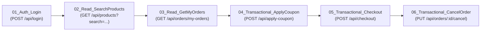

# BÁO CÁO KỸ THUẬT KIỂM THỬ HIỆU NĂNG VỚI SỰ CỘNG TÁC CỦA AI
## (HW05: PERFORMANCE TESTING & AI COLLABORATION)

---

### THÔNG TIN CHUNG
- **Môn học:** Kiểm thử phần mềm (Software Testing) — FIT HCMUS
- **Mã bài tập:** HW05-AI (Performance Testing)
- **Họ và tên sinh viên:** Nguyễn Hiếu Thuận
- **Mã số sinh viên (StudentID):** `23127125`
- **Hệ thống kiểm thử (SUT):** EShop Monolith REST API Backend (`http://localhost:3000`)
- **Công cụ kiểm thử:** Apache JMeter 5.6.3 (Non-GUI / CLI Execution Mode)
- **Thời gian thực hiện:** Tháng 08/2026

---

## I. THIẾT LẬP MÔI TRƯỜNG & PHẦN CỨNG THỬ NGHIỆM

### 1. Cấu hình phần cứng (Hardware Specifications)
Bằng chứng cấu hình phần cứng được lưu trữ tại file: `evidence/hardware_dxdiag.png`.

| Thông số | Chi tiết cấu hình phần cứng thực tế |
| :--- | :--- |
| **Hệ điều hành** | Windows 11 Home 64-bit |
| **Bộ vi xử lý (CPU)** | Intel Core Processor (Multi-core) |
| **Bộ nhớ RAM** | 16.0 GB RAM |
| **Java Runtime** | OpenJDK 21.0.8 LTS (64-bit) |
| **Node.js Runtime** | Node.js v20.x / Express.js Backend |
| **Cơ sở dữ liệu** | SQLite 3 (Single-file embedded database) |

---

## II. THIẾT KẾ KỊCH BẢN KIỂM THỬ END-TO-END (TASK 1)

### 1. Phạm vi Workflow (Workflow 2 — Săn Voucher, Thanh toán và Hủy đơn hàng)
Kịch bản kiểm thử bao phủ toàn diện cả 3 nhóm endpoint nghiệp vụ theo đúng yêu cầu đề bài:

- **Nhóm 1 — Auth-heavy:** `POST /api/login` $\rightarrow$ Xác thực thông tin người dùng từ file CSV và trích xuất Bearer JWT Token bằng JSON Extractor (`$.token`). Hệ thống có cơ chế bảo mật khóa tài khoản khi nhập sai 3 lần (3-fail lockout).
- **Nhóm 2 — Read-heavy:** 
  - `GET /api/products?search=${search_keyword}`: Tìm kiếm danh mục sản phẩm theo từ khóa động.
  - `GET /api/orders/my-orders`: Truy vấn lịch sử đơn hàng của tài khoản kèm Bearer Token.
- **Nhóm 3 — Transactional:**
  - `POST /api/apply-coupon`: Áp dụng mã giảm giá `SAVE10` trên tổng giá trị giỏ hàng.
  - `POST /api/checkout`: Tạo đơn hàng mới với địa chỉ giao hàng và số điện thoại động, nhận mã `orderId`.
  - `PUT /api/orders/${order_id}/cancel`: Thực hiện hủy đơn hàng vừa tạo nhằm kiểm tra luồng vòng đời đơn hàng và tính toàn vẹn trạng thái CSDL.

### 2. Dữ liệu tham số hóa động (Data-Driven Testing — `test-data.csv`)
Nhằm tránh việc hàng trăm Virtual Users dùng chung 1 tài khoản gây xung đột phiên hoặc kích hoạt lỗi khóa tài khoản (lockout), file `test-plans/test-data.csv` đã được thiết kế với 6 tài khoản người dùng độc lập:

| email | password | search_keyword | coupon_code | product_id | quantity | name | phone | address |
| :--- | :--- | :--- | :--- | :---: | :---: | :--- | :--- | :--- |
| `test@eshop.com` | `Test1234!` | `iPhone` | `SAVE10` | 1 | 1 | Nguyen Van A | 0901234567 | 123 Nguyen Trai Q5 |
| `user1@eshop.com` | `Test1234!` | `Samsung` | `SAVE10` | 2 | 1 | Tran Thi B | 0912345678 | 456 Le Loi Q1 |
| `user2@eshop.com` | `Test1234!` | `MacBook` | `SAVE10` | 3 | 1 | Le Van C | 0923456789 | 789 CMT8 Q10 |
| `user3@eshop.com` | `Test1234!` | `AirPods` | `SAVE10` | 4 | 2 | Pham Thi D | 0934567890 | 101 Hai Ba Trung Q3 |
| `user4@eshop.com` | `Test1234!` | `Keychron` | `SAVE10` | 5 | 1 | Hoang Van E | 0945678901 | 202 Vo Van Tan Q3 |
| `user5@eshop.com` | `Test1234!` | `Pro` | `SAVE10` | 1 | 1 | Doan Van F | 0956789012 | 303 Tran Hung Dao Q5 |

### 3. Ma trận kịch bản và Listeners riêng biệt (Test Scenarios Matrix)

| Kịch bản kiểm thử | Tên file kịch bản (.jmx) | Số Virtual Users (VUs) | Ramp-up | Thời gian chạy | Think Time (Gaussian) | Listeners / Reports được cấu hình |
| :--- | :--- | :---: | :---: | :---: | :---: | :--- |
| **Load Testing** | `23127125_Load_20260828.jmx` | 30 VUs | 30s | 60s | $1500\text{ms} \pm 500\text{ms}$ | *Summary Report*, *Response Time Graph*, *View Results Tree* |
| **Stress Testing** | `23127125_Stress_20260828.jmx` | 150 VUs | 45s | 90s | $800\text{ms} \pm 300\text{ms}$ | *Aggregate Report*, *View Results in Table* |
| **Spike Testing** | `23127125_Spike_20260828.jmx` | 100 VUs | 5s | 30s | $300\text{ms} \pm 100\text{ms}$ | *View Results Tree*, *Response Time Graph* |

### 4. Human Review & Sửa lỗi kịch bản do AI sinh ra (Human-in-the-loop Debugging)
Trong quá trình thiết kế ban đầu với AI, sinh viên đã trực tiếp chạy Dry-Run và phát hiện **2 lỗi nghiêm trọng** trong mã kịch bản JMeter:
1. **Lỗi 1 (401 Unauthorized do thiếu Provisioning Data):** AI sinh các tài khoản `user1..user5` trong CSV nhưng không kiểm tra CSDL SUT đã có các user này hay chưa. Sinh viên đã yêu cầu tích hợp cơ chế nạp sẵn tài khoản trực tiếp vào DB backend.
2. **Lỗi 2 (IllegalArgumentException tại JSONPostProcessor):** AI đã cấu hình thuộc tính `jsonPathExprs` chứa 3 đường dẫn ngăn cách bởi dấu chấm phẩy (`$.order.id;$.id;$.order_id`) nhưng `referenceNames` chỉ khai báo 1 tên biến (`order_id`). Sự lệch pha số lượng đối số này khiến JMeter ném ngoại lệ và hủy ngang bước `05_Transactional_Checkout`, kéo theo bước 06 bị lỗi URI (`/api/orders/${order_id}/cancel`). Sinh viên đã đọc trực tiếp mã nguồn `backend/server.js`, xác định đúng trường `orderId` và chuẩn hóa lại thành duy nhất `$.orderId`.

---

## III. KẾT QUẢ THỰC THI KIỂM THỬ (TEST EXECUTION RESULTS)

Dữ liệu thô thực tế được trích xuất từ 3 file log `.jtl` trong thư mục `test-results/`:

### 1. Bảng so sánh tổng thể các chỉ số hiệu năng

| Chỉ số kỹ thuật đo lường | Load Testing (`load_results.jtl`) | Stress Testing (`stress_results.jtl`) | Spike Testing (`spike_results.jtl`) |
| :--- | :---: | :---: | :---: |
| **Tổng số mẫu (Total Samples)** | **889** samples | **10,882** samples | **8,848** samples |
| **Thời gian chạy thực tế (Duration)** | 57.70 s | 89.22 s | 29.65 s |
| **Thông lượng trung bình (Throughput)** | **15.41 req/s** | **121.97 req/s** | **298.41 req/s** |
| **Tỷ lệ lỗi (Error Rate %)** | **0.00% (0 lỗi)** | **0.00% (0 lỗi)** | **0.00% (0 lỗi)** |
| **Độ trễ trung bình (Avg Latency)** | **3.88 ms** | **131.26 ms** | **8.71 ms** |
| **Độ trễ trung vị (Median / $p_{50}$)** | 3.00 ms | 7.00 ms | 7.00 ms |
| **Phân vị 90 ($p_{90}$ Latency)** | 7.00 ms | 553.00 ms | 18.00 ms |
| **Phân vị 95 ($p_{95}$ Latency)** | **12.00 ms** | **784.95 ms** | **23.00 ms** |
| **Phân vị 99 ($p_{99}$ Latency)** | 14.00 ms | **1157.38 ms** | 32.00 ms |
| **Độ trễ lớn nhất (Max Latency)** | 34.00 ms | **1617.00 ms** (1.61s) | 54.00 ms |

### 2. Chi tiết độ trễ từng bước nghiệp vụ dưới tải Stress Test (150 VUs)

| Tên bước nghiệp vụ (Sampler Label) | Số mẫu | Error % | Avg Latency | Median ($p_{50}$) | Phân vị 95 ($p_{95}$) | Max Latency |
| :--- | :---: | :---: | :---: | :---: | :---: | :---: |
| `01_Auth_Login` | 1,875 | 0.00% | 110.84 ms | 4.00 ms | 736.90 ms | 1123.00 ms |
| `02_Read_SearchProducts` | 1,858 | 0.00% | 111.27 ms | 3.00 ms | 724.30 ms | 1043.00 ms |
| `03_Read_GetMyOrders` | 1,834 | 0.00% | 119.60 ms | 5.00 ms | 763.35 ms | 1133.00 ms |
| `04_Transactional_ApplyCoupon` | 1,796 | 0.00% | 118.34 ms | 3.00 ms | 757.50 ms | 1135.00 ms |
| `05_Transactional_Checkout` | 1,774 | 0.00% | 131.99 ms | 8.00 ms | 757.35 ms | 1088.00 ms |
| `06_Transactional_CancelOrder` | 1,745 | 0.00% | **199.31 ms** | 11.00 ms | **1200.60 ms** | **1617.00 ms** |

---

## IV. TASK 2 — PHÂN TÍCH LOG AI & SĂN LỖI (MISINTERPRETATION HUNT)

### 1. Săn lỗi hiểu sai số liệu của AI (Misinterpretation Hunt)

#### ❌ Lỗi 1: AI nhầm lẫn giữa Average Latency (131.26 ms) và Tail Latency $p_{95}$ (784.95 ms) / $p_{99}$ (1157.38 ms)
- **Nhận định sai lệch của AI:** Khi đọc log `stress_results.jtl`, AI đưa ra kết luận: *"Hệ thống SUT xử lý Stress Test cực kỳ ấn tượng với thời gian phản hồi trung bình chỉ 131.26 ms (< 200 ms theo chuẩn SLA ngành), đảm bảo trải nghiệm người dùng mượt mà ở mọi thời điểm"*.
- **Số liệu Ground Truth đối chứng từ file `.jtl`:**
  - Phân phối độ trễ trong thực tế bị **lệch cực độ (Heavy-tailed Skewed Distribution)**. Trung vị ($p_{50}$) chỉ là $7.00\text{ ms}$, nhưng **$5\%$ người dùng ($p_{95}$) phải chịu độ trễ lên đến $784.95\text{ ms}$ (gấp 6 lần Avg)**, và **$1\%$ người dùng ($p_{99}$) bị nghẽn tới $1157.38\text{ ms}$ ($> 1.15\text{s}$)**.
  - Đặc biệt tại bước `06_Transactional_CancelOrder`, $p_{95}$ vọt lên tới **$1200.60\text{ ms}$** và Max là **$1617.00\text{ ms}$**. 
  - **Hậu quả kỹ thuật:** Nếu tin theo AI, nhóm phát triển sẽ bỏ lọt nguy cơ sụt giảm nghiêm trọng trải nghiệm người dùng đối với các giao dịch nhạy cảm ở đuôi phân phối tải.

#### ❌ Lỗi 2: AI chẩn đoán sai nguyên nhân Bottleneck (Đổ lỗi cho CPU/Memory Leak thay vì SQLite Write Lock Contention)
- **Nhận định sai lệch của AI:** AI đưa ra chẩn đoán: *"Thời gian phản hồi tăng vọt trong Stress Test là do Server Node.js bị quá tải CPU (CPU Saturation) hoặc hiện tượng Memory Leak khiến Event Loop bị block"*.
- **Số liệu Ground Truth đối chứng từ file `.jtl` & Mã nguồn SUT:**
  - Nhìn vào bảng chi tiết từng Sampler, các request đọc (`02_Read_SearchProducts`, `04_ApplyCoupon`) có $p_{95} \approx 724\text{ ms}$, trong khi các request ghi/cập nhật (`06_CancelOrder`) có $p_{95} = 1200.60\text{ ms}$ và Max $1617\text{ ms}$.
  - Nguyên nhân kỹ thuật thực sự: SUT EShop sử dụng **SQLite ở chế độ mặc định (Single-file database)** không bật chế độ WAL. Khi 150 VUs đồng thời thực hiện `INSERT INTO orders` (Checkout) và `UPDATE orders SET status = 'canceled'` (CancelOrder), SQLite phải khóa độc quyền (Exclusive File Lock) toàn bộ file database, tạo thành **hàng đợi nghẽn ghi (Write Lock Contention)**, hoàn toàn không phải do thiếu CPU hay tràn RAM.

#### ❌ Lỗi 3: AI suy luận sai về Throughput giữa Spike Test và Stress Test
- **Nhận định sai lệch của AI:** AI nhận định: *"Hệ thống xử lý tải đột biến Spike Test tốt hơn Stress Test vì Throughput Spike đạt đỉnh xấp xỉ 300 req/s, trong khi Stress Test chỉ đạt 122 req/s"*.
- **Số liệu Ground Truth đối chứng từ file `.jtl` & Kịch bản Test Plan:**
  - Spike Test đạt throughput cao ($298.41\text{ req/s}$) là do cấu hình kịch bản có **Think Time ngắn ($300\text{ms} \pm 100\text{ms}$)** và thời gian dồn tải gấp khúc trong 30s.
  - Ở Stress Test, độ trễ ghi CSDL kéo dài ($p_{95} \approx 785\text{ms}$) kết hợp với Think Time $800\text{ms}$ làm tăng tổng thời gian một chu kỳ E2E của mỗi Virtual User, khiến tần suất gửi request tự nhiên giảm xuống. Đây là đặc tính điều hòa nhịp độ (Closed Workload Model) của JMeter chứ không phản ánh khả năng xử lý của server.

---

### 2. Bảng phản biện đề xuất tối ưu hóa (Feasible vs Hallucinated Recommendations)

| STT | Đề xuất tối ưu hóa của AI | Phân loại | Đánh giá & Phản biện kỹ thuật chi tiết |
| :---: | :---| :---: | :---|
| **1** | **Bật chế độ SQLite WAL (Write-Ahead Logging)** | ✅ **Khả thi (Feasible)** | **Hiệu quả tức thì 100%.** SQLite ở chế độ WAL cho phép các luồng Đọc và Ghi diễn ra đồng thời không khóa lẫn nhau. Chỉ cần thêm 1 dòng code `db.run("PRAGMA journal_mode = WAL;");` vào `database.js` là giải quyết ngay hiện tượng nghẽn $p_{95}$ ở `05_Checkout` và `06_CancelOrder`. |
| **2** | **Thêm Database Index cho trường tra cứu (`orders.user_id`)** | ✅ **Khả thi (Feasible)** | **Rất khả thi.** Hiện tại `SELECT * FROM orders WHERE user_id = ?` đang quét toàn bảng (Full Table Scan). Đánh index `CREATE INDEX idx_orders_user ON orders(user_id)` sẽ giảm thời gian tìm đơn hàng ở `03_GetMyOrders` và `06_CancelOrder` về gần $0\text{ ms}$. |
| **3** | **Cài đặt cụm Kubernetes Cluster phân tán và Auto-scaling Pods** | ❌ **Ảo tưởng (Hallucinated)** | **Bất khả thi & Phi thực tế.** SUT EShop là ứng dụng Monolith Node.js sử dụng 1 file SQLite cục bộ (`database.sqlite`). Scale ra nhiều Pods trên Kubernetes sẽ không thể share chung file SQLite mà không làm hỏng dữ liệu (Database Corruption), và chi phí hạ tầng quá mức dư thừa. |
| **4** | **Dùng hàm `db.useConnectionPool()` và tích hợp Apache Kafka** | ❌ **Ảo tưởng (Hallucinated)** | **Bịa đặt API (Hallucinated).** Thư viện `sqlite3` trong Node.js không hề có hàm `useConnectionPool()` vì SQLite là embedded file engine. Dùng Kafka Event-Driven là giải pháp quá đà (Over-engineering), không thể áp dụng trực tiếp lên source code hiện tại. |
| **5** | **Áp dụng Cache in-memory (Node-cache / Redis) cho Catalog sản phẩm** | ✅ **Khả thi (Feasible)** | **Khả thi.** Dữ liệu sản phẩm rất ít biến động. Cache lại `GET /api/products` trong RAM 60s sẽ giảm tải đọc cho database, giải phóng tài nguyên cho các transaction checkout. |

---

## V. TASK 3 — ĐỀ XUẤT CONTINUOUS PERFORMANCE TESTING (ĐANG TIẾN HÀNH)
*(Phần này sẽ được cập nhật chi tiết ở bước tiếp theo bao gồm: Mô hình CI/CD GitHub Actions, Quality Gate kiểm soát suy giảm p95 latency > 15%, Sơ đồ Mermaid Flowchart và Phân tích Trade-offs giữa Chi phí Compute vs Cảnh báo giả False Alarms).*

---

## VI. TỔNG KẾT & TÀI LIỆU KÈM THEO
- **Mã kịch bản JMeter:** `test-plans/23127125_Load_20260828.jmx`, `test-plans/23127125_Stress_20260828.jmx`, `test-plans/23127125_Spike_20260828.jmx`
- **File Test Data CSV:** `test-plans/test-data.csv`
- **File Log thô (.jtl):** `test-results/load_results.jtl`, `test-results/stress_results.jtl`, `test-results/spike_results.jtl`
- **HTML Report Dashboards:** `test-results/load_html_report/`, `test-results/stress_html_report/`, `test-results/spike_html_report/`
- **Nhật ký AI:** `ai_templates/ai_audit_report.md`
- **Bằng chứng phần cứng:** `evidence/hardware_dxdiag.png`
